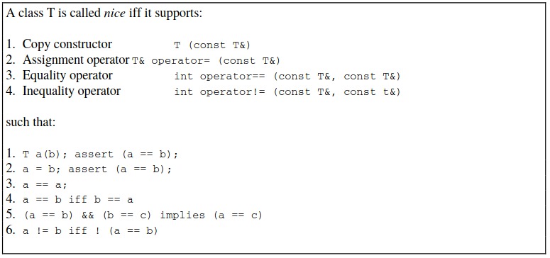
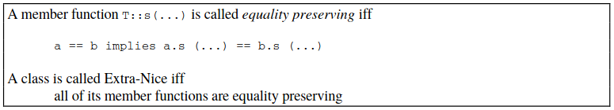
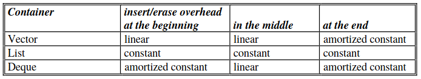
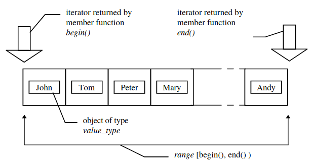
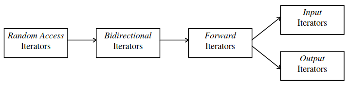
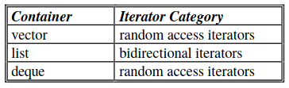
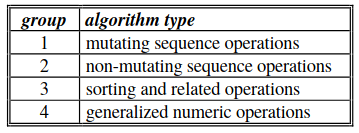

# STL Tutorial

In this tutorial we present examples from the [STL Tutorial](http://www.cmapx.polytechnique.fr/~benaych/stl-tutorial-Weidl.pdf). 

To run the code: 
```
g++ script_name.cpp -o script_name
./script_name
```
<b>Nice Classes.</b> For STL it’s wise to create classes that meet the requirements of <i>Nice Classes</i>. Forexample, Borland C++ expects an object to be stored in a container to have an assignment operatordefined. Additionally, if a container holds its objects in a particular order, a operator like the `operator<<` must be defined (the latter to fix a half-order).




The following table shows the <b>insert</b> and <b>erase</b> overheads of the containers <b>vector</b>, <b>list</b> and <b>deque</b>. Think of these overheads when choosing a container for solving a specific task.



For `stl_6.cpp` script, `v.begin()` returns an iterator to the first element in the vector. The iterator can be dereferenced and incremented like a C++ pointer. Please note, that `v.end()` doesn’t return an iterator that points to the last element in the vector - as now could be supposed - but <i>past</i> the last element (however, in the STL code such an iterator is named `last`). Accordingly it is called <i>past-the-end</i> iterator. A user is not supposed to dereference such an iterator, because the result would be undefined. The `while` loop checks if the `first` iterator is equal to the `last` iterator. If not, the iterator is dereferenced to get the object it is pointing to, then it is incremented. So, all vector elements are written to `cout`.



There are five categories of iterators. Iterators differ in the operations defined on them. Each iterator is designed to <i>satisfy</i> a well-defined set of requirements. These requirements define what operations can be applied to the iterator. According to these requirements the iterators can be assigned to the five categories. Iterator categories can be arranged from left to right to express that the iterator category on the left satisfies the requirements of all the iterator categories on the right (and so could be called more powerful).



The following table shows the iterators that can be used with the containers `vector`, `list` and `deque` (of course all iterators that satisfy the requirements of the listed iterators can be used as well):



All the algorithms provided by the library are parametrized by iterator types and are so seperated from particular implementations of data structures. Because of that they are called <i>generic algorithms</i>.

The algorithms delivered with the library are divided into four groups:


