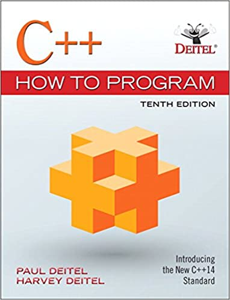

# C++ Learning Archive

## This repository contains different materials for learning and improving Cpp skills.

# List of materials

1. [C++ How to Program (10th Edition) by Paul Deitel and Harvey Deitel](./Deitel/)
2. [Data Structures Using C++ by D.S. Malik](./Malik/)
3. [Advanced C++ Source Code Examples](./AdvancedCpp/)
4. [C++ STL Library Examples](./CppSTL/)
5. [C++ Boost Library Examples / Boost C++ Application Development Cookbook by Antony Polukhin ](./CppBoost/)
6. [Discovering Modern C++ (2nd edition) by Peter Gottschling](./DiscoveringModernCpp/)
7. [Desing Patterns in C++ TODO !!](./DesingPatterns)

` You can follow with the same sequence...`

---

C++ source codes from book we have used:

- **C++ How to Program (10th Edition) by Paul Deitel and Harvey Deitel**

- **Data Structures Using C++ by D.S. Malik**

- **Discovering Modern C++ (2nd edition) by Peter Gottschling**
  

- **Boost C++ Application Development Cookbook - Second Edition**

# What does this repo include ?

- Important part of these books' source codes and other source code examples.

You can also:

- Add others book and source codes to this repo

### Development

Want to contribute? Great!

Create branch and push to me.

### [Chapter List for Deitel](./Deitel/)

> - **Chapter 1** - [Introduction to Computers and C++]
> - **Chapter 2** - [Introduction to C++ Programming]
> - **Chapter 3** - [Introduction to Classes, Objects and Strings]
> - **Chapter 4** - [Control Statements: Part I]
> - **Chapter 5** - [Control Statements: Part II]
> - **Chapter 6** - [Functions and an Introduction to Recursion]
> - **Chapter 7** - [Arrays and Vectors]
> - **Chapter 8** - [Pointers]
> - **Chapter 9** - [Classes: A Deeper Look, Part I]
> - **Chapter 10** . [Classes: A Deeper Look, Part II]
> - **Chapter 11** - [Operator Overloading: Class String]
> - **Chapter 12** - [Object-Oriented Programming: Inheritance]
> - **Chapter 13** - [Object-Oriented Programming: Polymorphism]
> - **Chapter 14** - [Templates]
> - **Chapter 15** - [Stream Input/Output]
> - **Chapter 16** - [Exception Handling: A Deeper Look]
> - **Chapter 17** - [File Processing]
> - **Chapter 18** - [Class _string_ and String Stream Processing]
> - **Chapter 19** - [Searching and Sorting]
> - **Chapter 20** - [Custom Templatized Data Structures]
> - **Chapter 21** - [Bits, Characters, C String and _structs_]
> - **Chapter 22** - Standard Template Library (STL)
> - **Chapter 23** - Boost Libraries, Technical Report I and C++0x
> - **Chapter 24** - Other Topics

### [Chapter List for Malik](./Malik/)

> - **Chapter 1** - [clockType,persontype,fruitJuiceMachine,stackType]
> - **Chapter 2** - [Building manual linkedStackType class]
> - **Chapter 3** - [Building manual unorderedLinkedListStackType]
> - **Chapter 4** - [LinkedListType and LinkedListType from C++ library <list>]
> - **Chapter 5** - [Build using abstract class linkedListType]
> - **Chapter 6** - [Build using derived class orderedLinkedListType]
> - **Chapter 7** - [Build using derived class UnorderedLikedListType]

### [Chapter List for Advanced C++ Source Code Examples](./AdvancedCpp/)

> - WritingABitmap
> - UsingtheHistogram
> - ObjectInitialization
> - CustomObjectsAsMapKeys
> - InitializationInC11
> - OverloadingtheDereferenceOperator
> - Vectors
> - StoringIterations
> - StandardExceptions
> - DecltypeAndTypeid
> - DelegatingConctructors
> - TwoDimensionalVectors
> - AMandelbrotClass
> - ReinterpretCast
> - ColourHistograms
> - InitializationInC98
> - VectorsAndMemory
> - StaticCast
> - HelloWorld
> - LambdaParametersAndReturnTypes
> - DynamicCasts
> - BitmapInfoHeaders
> - IterableClasses
> - TemplateFunctionsandTypeInference
> - SettingPixels
> - TheFractalAlgorithm
> - UsingtheRGBClass
> - StructPadding
> - ColorTransforms
> - ZoomingIn
> - UsingFunctionPointersAnExample
> - Lists
> - RvalueReferences
> - Complex Numbers Overview.pdf
> - AComplexNumberClass
> - Scaling
> - CapturingThisWithLambdas
> - ReadingTextFiles
> - NestedTemplateClasses
> - AnRGBClass
> - SharedPointers
> - RingBuffer
> - LValueReferences
> - TheZoomList
> - AutoPointers
> - ValidatingtheHistogram
> - OverloadingtheLeftBitShiftOperator
> - ImprovingtheBasicFractal
> - ReorganisingMain
> - LambdaExpressions
> - Functors
> - ObjectSlicingandPolymorphism
> - CatchingSubclassExceptions
> - CustomExceptions
> - RangeBasedColoring
> - OverloadingtheInsertionOperatorforPrinting
> - ImplementingFractalCreator
> - TemplateClasses
> - EnhancedForLoop
> - ABitmapClass
> - InitializerLists
> - BinaryFiles
> - AZoomClass
> - FunctionalTypes
> - StacksAndQueues
> - BitmapHeaderValues
> - GettingPixelRanges
> - PerfectForwarding
> - CustomObjectsAsMapValues
> - BitmapFileHeaders
> - Maps
> - BasicExceptions
> - MutableLambdas
> - SortingVectorsDequeFriend
> - WritingTextFiles
> - SpecifyingColorRanges
> - MoveAssignmentOperators
> - OverloadingtheAssignmentOperator
> - FunctionPointers
> - FractalCreatorHelloWorld
> - OverloadingPlus
> - ApplyingtheZoom
> - StlComplexDataTypes
> - CenteringandScaling
> - OverloadingComparisonOperators
> - TemplateFunctions1
> - CalculatingRangeTotals
> - MultipleInheritance
> - TheAutoKeyword
> - LambdaCaptureExpressions
> - CheckingtheRangeTotals
> - AbstractClasses
> - ElisionandOptimization
> - MoveConstructors
> - Bind
> - lValuesandrValues
> - EliminatingMaxIterations
> - ReadingandWritingBinaryFiles
> - ParsingTextinFiles
> - ConstructorsandMemory
> - BitmapMemory

### [Chapter List for C++ STL Library Examples](./CppSTL/)

> - **Chapter 1** -
> - **Chapter 2** -
> - **Chapter 3** -

### [Chapter List for C++ Boost Library Examples / Boost C++ Application Development Cookbook by Antony Polukhin](./CppBoost/)

> - **Chapter 1** -
> - **Chapter 2** -
> - **Chapter 3** -
> - **Chapter 4** -
> - **Chapter 5** -
> - **Chapter 6** -
> - **Chapter 7** -
> - **Chapter 8** -
> - **Chapter 9** -
> - **Chapter 10** -
> - **Chapter 11** -
> - **Chapter 12** -

### [Chapter List for Discovering Modern C++ (2nd edition) by Peter Gottschling](./DiscoveringModernCpp/)

> - **Chapter 1** C++03
> - **Chapter 2** C++11
> - **Chapter 3** C++14
> - **Chapter 4** C++17
> - **Chapter 5** C++20
> - **Chapter 6** C++20vs

### THANKS

Special thank you for:

- Sidney Watson
- Ian Scahfer
- Peter Gottschling
- Antony Polukhin
  This repo couldn't be done without them.

## License

MIT

**Free Software, Hell Yeah!**

# Buy Me Coffee

`0xd20E868d12E3f9dA8aC396e81a2Ec628A86100aF`
